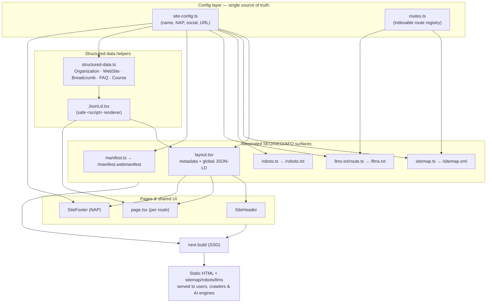

# Parul University Goa — Website

The official **Parul University Goa** website (Goa's first State Private University), engineered for **SEO** (search engine), **GEO** (generative-engine / AI-answer), and **AEO** (answer-engine / featured-snippet) optimisation from the ground up.

Built statically (SSG) so every page ships as pre-rendered HTML — the fastest, most crawlable, most AI-citable form a page can take.

> **Maintenance note:** this README is the living source of truth for the project. Keep the [System architecture](#system-architecture), [Directory structure](#directory-structure), and [Changelog](#changelog) sections updated whenever the structure or capabilities change.

---

## Tech stack

| Concern | Choice | Notes |
|---|---|---|
| Framework | **Next.js 16** (App Router) | Static export (SSG); Metadata API for SEO |
| UI library | **React 19** | Server Components by default |
| Styling | **Tailwind CSS v4** | Configured via CSS `@theme` in `globals.css` — **no** `tailwind.config.js` |
| Language | **TypeScript 5** | `strict` mode |
| Fonts | `next/font/local` (**Gotham**) | Self-hosted from `src/fonts/`, zero layout shift |
| Rendering | **SSG** | All routes pre-rendered at build time |

> ⚠️ This Next.js 16 has breaking changes from earlier versions. The bundled docs at `node_modules/next/dist/docs/` are the source of truth — consult them before using an unfamiliar API (see `AGENTS.md`).

---

## System architecture

The site is a statically-generated Next.js App Router project. A single **config layer** feeds every SEO/GEO/AEO surface, so a fact (name, address, URL) is defined once and propagates everywhere.



### How a request is served
Because everything is SSG, there is no per-request rendering. `next build` pre-renders each route to static HTML (with JSON-LD inlined in `<head>`/`<body>`), plus the `sitemap.xml`, `robots.txt`, `llms.txt`, and `manifest.webmanifest` files. A CDN/host serves these directly.

### The three optimisation layers
- **SEO** — `metadata` exports (title template, canonical, Open Graph, Twitter, robots directives), `sitemap.xml`, `robots.txt`.
- **AEO** — semantic HTML with a single `<h1>` per page and clear heading hierarchy; `FAQPage` and `BreadcrumbList` JSON-LD make pages eligible for rich results and featured snippets.
- **GEO** — `CollegeOrUniversity` + `WebSite` JSON-LD define the entity for AI engines; `robots.txt` explicitly allows AI crawlers (GPTBot, ClaudeBot, PerplexityBot, Google-Extended, …); `llms.txt` gives those engines a curated page map.

---

## Directory structure

```
paruluniversity/
├── src/
│   ├── app/
│   │   ├── layout.tsx              # Root layout: Gotham font + site-wide metadata + Organization/WebSite JSON-LD + header/footer
│   │   ├── page.tsx                # Landing page (composes the landing sections)
│   │   ├── admissions/page.tsx     # Admissions 2026 (Apply CTA destination)
│   │   ├── globals.css             # Tailwind v4 entry + @theme brand tokens
│   │   ├── sitemap.ts              # → /sitemap.xml (from routes registry)
│   │   ├── robots.ts               # → /robots.txt (AI-crawler friendly)
│   │   ├── manifest.ts             # → /manifest.webmanifest (PWA)
│   │   └── llms.txt/route.ts       # → /llms.txt (AI engine page map)
│   ├── components/
│   │   ├── landing/                # One file per landing section, composed in page.tsx
│   │   │   ├── Decor.tsx           # Shared: Eyebrow + Wave divider (reused by every band)
│   │   │   ├── Hero.tsx            # Headline + badge + campus render + 3 CTA pills (#hero)
│   │   │   ├── StatsBar.tsx        # Warm-dark stats band (#stats)
│   │   │   ├── Philosophy.tsx      # Cyan band, wave dividers + 3 yellow cards (#philosophy)
│   │   │   ├── ProgrammeFinder.tsx # Selector funnel + faculty card grid + counsellor band (#programmes) — client
│   │   │   ├── Admissions.tsx      # "Key dates" — windows, deadlines, accepted tests (#admissions)
│   │   │   ├── Placements.tsx      # "Numbers that matter" — ₹60 LPA card + stat trio (#placements)
│   │   │   ├── Outcomes.tsx        # Recruiter wordmark wall (monochrome)
│   │   │   ├── Research.tsx        # Research + Entrepreneurship cyan cards (#research)
│   │   │   ├── Testimonial.tsx     # Student quote + avatar
│   │   │   ├── CampusTour.tsx      # Red band, 3D-tour video placeholder (#campus-tour)
│   │   │   ├── CampusLife.tsx      # 4 facility cards: Food/Medical/Hostels/Transport (#campus-life)
│   │   │   ├── WhyGoa.tsx          # Cyan band — Goa as academic advantage
│   │   │   ├── International.tsx   # Global pathways, country list + 3 cards (#international)
│   │   │   ├── News.tsx            # 3 story cards (#news)
│   │   │   ├── Faq.tsx             # <details> accordion + FAQPage JSON-LD (#faq)
│   │   │   ├── FinalCta.tsx        # "Ready to begin?" photo CTA → footer wave
│   │   │   └── StickyApplyBar.tsx  # CTA bar that fixes after hero scroll — client
│   │   ├── layout/
│   │   │   ├── SiteHeader.tsx      # Two-row nav + Apply Now (client; mobile menu)
│   │   │   └── SiteFooter.tsx      # Site-wide footer w/ NAP (#contact)
│   │   └── seo/
│   │       └── JsonLd.tsx          # Safe JSON-LD <script> renderer
│   ├── lib/
│   │   ├── site-config.ts          # ⭐ Single source of truth: name, NAP, social, URL
│   │   ├── fonts.ts                # Gotham via next/font/local (→ --font-gotham → font-sans)
│   │   ├── navigation.ts           # Nav items + CTA targets (header/hero/sticky share this)
│   │   ├── routes.ts               # Registry of indexable routes (feeds sitemap + llms.txt)
│   │   └── structured-data.ts      # Typed schema.org builders
│   └── fonts/                      # Self-hosted Gotham .otf files + OFL.txt
├── design/                         # 🎨 Design inbox: drop Figma exports here (SVG/PDF/PNG) — see design/README.md
│   ├── screens/ brand/ components/ photos/ tokens/
│   └── README.md                   # Upload guide (what format goes where)
├── .env.local                      # NEXT_PUBLIC_SITE_URL (canonical origin)
├── AGENTS.md / CLAUDE.md           # Next 16 breaking-changes notice
└── README.md                       # This file
```

---

## Getting started

```bash
npm install        # if dependencies aren't installed yet
npm run dev        # dev server → http://localhost:3000
npm run build      # production SSG build
npm run start      # serve the production build
npm run lint       # ESLint
```

After a build, verify the SEO endpoints: `/sitemap.xml`, `/robots.txt`, `/llms.txt`, `/manifest.webmanifest`, and the inlined JSON-LD in the page source.

---

## Configuration

All site-wide facts live in [`src/lib/site-config.ts`](src/lib/site-config.ts). Edit there, not in individual components.

| Setting | Where | Purpose |
|---|---|---|
| Canonical origin | `.env.local` → `NEXT_PUBLIC_SITE_URL` | Base for canonical/OG URLs, sitemap, robots |
| Name / description | `siteConfig` | Title template, meta, schema |
| **NAP** (address, phone, email, geo) | `siteConfig.contact` | Footer + `CollegeOrUniversity` schema |
| Social URLs | `siteConfig.social` | Schema `sameAs` entity links |

---

## Extending the site

**Add a new page/section:**
1. Create `src/app/<section>/page.tsx` with its own `export const metadata` (title, description, `alternates.canonical`).
2. Add the route to [`src/lib/routes.ts`](src/lib/routes.ts) so it enters `sitemap.xml` and `llms.txt` — **only after the page exists** (never list a 404).
3. Wire the nav `href` in `SiteHeader.tsx` from `"#"` to the real path.

**Add structured data to a page:** import a builder from [`src/lib/structured-data.ts`](src/lib/structured-data.ts) and render it via `<JsonLd data={...} />`. Only emit schema for content actually visible on the page.
- Program/course page → `courseSchema(...)`
- Any page with Q&A → `faqSchema(...)`
- Inner pages → `breadcrumbSchema(...)`

---

## Launch checklist

Launch-blocking items are marked `TODO` in `site-config.ts`. They must be **accurate** — NAP and entity consistency are real ranking/trust signals.

- [ ] Real campus address, PIN, phone, enquiry email, and map geo-coordinates
- [ ] Official social profile URLs (Facebook, Instagram, X, YouTube, LinkedIn)
- [ ] Brand colors + fonts wired into Tailwind `@theme` (from Figma)
- [ ] `og-default.png` (1200×630), `logo.png`, `icon-192.png`, `icon-512.png` in `/public`
- [ ] `NEXT_PUBLIC_SITE_URL` set to the production domain
- [ ] Validate structured data with [Rich Results Test](https://search.google.com/test/rich-results)

---

## Changelog

Newest first. Update on every meaningful structural or capability change.

### 2026-05-27 — Full landing page rebuilt to the Figma design
- Rebuilt the homepage to match `design/brand/Landing page.pdf` end-to-end. Palette **re-sampled from the export** and updated in `globals.css @theme`: brand red `#e73649`, sunshine `#fedb2f`, bright cyan `#0babe0` (`--color-ocean`), sky gradient (`--color-sky` / `-soft` / `-deep`), warm-dark stats band `#1e190c` (`--color-ink-warm`), `--color-cream`.
- Added `Decor.tsx` (shared `Eyebrow` + a single layered `Wave` divider) and **13 new section components** (see Directory structure): Admissions, Placements, Outcomes, Research, Testimonial, CampusTour, CampusLife, WhyGoa, International, News, Faq, FinalCta — composed in `page.tsx` in the design's order.
- `Hero` now carries the headline + yellow "Admissions Open" badge + the **campus-gate render** (`public/hero-campus.webp`, extracted/optimised from the design's embedded 4K image) with the three CTA pills (Apply / Counsellor / Brochure) overlapping its base. Removed the gauge badge.
- `Faq` is a **zero-JS** `<details>` accordion whose Q&As also feed `FAQPage` JSON-LD (kept in lockstep so the markup never lists unseen content).
- `SiteFooter` rebuilt to the design: cyan band, white lockup, NAP block, and Quick Links / Programmes / Accreditations columns. `site-config.ts` NAP updated from the footer (campus address, toll-free number, `admissions@goa.paruluniversity.ac.in`) — ⚠️ still verify with the university.
- Nav anchors repointed to the new section ids (`#admissions`, `#placements`, `#research`, `#campus-life`, `#international`, `#news`).
- Build verified: all 9 routes static (SSG); rendered output screenshot-checked against the PDF.
- **Image TODOs** (currently brand-gradient placeholders): 3D-tour video poster, testimonial portrait, Why-Goa photo, the 3 news thumbnails, and the ₹60 LPA student photo. Drop real files in `/public` and swap the placeholder blocks for `<Image>`. Recruiter "logos" are rendered as monochrome wordmarks (no fabricated trademarks).

### 2026-05-27 — Design inbox
- Added `design/` — a dedicated folder to upload Figma exports (SVG/PDF/PNG) used to rebuild the site to match the design. Subfolders: `screens/`, `brand/`, `components/`, `photos/`, `tokens/`. `design/README.md` documents which format goes where and what happens after upload. Not served publicly (reference only; generated assets go to `/public`).

### 2026-05-27 — Header polish
- Reworked `SiteHeader` to match the design exactly: **white** "Parul® University" logo (was dark), white row-1 nav, larger red "Apply Now" pill, and a more saturated row-2 strip (`#a6d2ef`) with dark centered nav.
- Logo lockup typography matched to the design: heavy "Parul" (Gotham Black 800) + thin "University" (**Gotham Light 300**, added weight to `fonts.ts`), with the ® tucked as a tight superscript.

### 2026-05-27 — Brand font
- Switched the site-wide font from Poppins to **Gotham**, self-hosted from `src/fonts/` via `next/font/local` (`src/lib/fonts.ts`, weights 400/500/700/800 + italics).
- Removed the redundant in-hero CTA pill (Apply/Counsellor/Brochure now live only in the header + StickyApplyBar); re-centred the hero content.
- Note: this Gotham set has no SemiBold (600) — `font-semibold` resolves to 700. Poppins `.ttf` files were also added to `src/fonts/` but are unused.

### 2026-05-27 — Landing page
- Rebranded to **Parul University Goa** (site-config, metadata, copy).
- Brand design system: red/sky/ocean/yellow/ink tokens in `globals.css @theme`; **Poppins** font.
- Built the functional landing page: two-row `SiteHeader` (mobile menu + Apply Now), `Hero` (headline, badge, CTA pill), `StatsBar`, `Philosophy` (SVG ocean-wave dividers + 3 cards), and a functional `ProgrammeFinder` (level/field selectors).
- **Hero intro animation** (pure CSS, reduced-motion aware): opens on the big "Parul® University Goa" lockup, which swipe-left-fades out before the headline + CTA fade up.
- **`StickyApplyBar`**: CTA toggle (Apply / Counsellor / Brochure) hidden over the hero, revealed once scrolled past `#hero`, then fixed to the viewport bottom (rAF-throttled scroll).
- Centralised nav + CTA targets in `lib/navigation.ts`; all nav links functional (smooth-scroll anchors / routes).
- Added `/admissions` placeholder page (Apply destination) with breadcrumb JSON-LD; registered in the route registry.
- Build verified: all 9 routes static (SSG).
- **TODOs surfaced:** real campus hero image (`/hero-campus.jpg`), brochure PDF (`/parul-goa-brochure-2026.pdf`), confirm the repeated "The Lighthouse" card eyebrow, and set `NEXT_PUBLIC_SITE_URL` to the real Goa domain.

### 2026-05-27 — Foundation
- Project scaffolded: Next.js 16 + React 19 + Tailwind v4 + TypeScript (SSG).
- SEO/GEO/AEO foundation built and verified via production build (all routes static):
  - Central `site-config.ts` and `routes.ts` config layer.
  - Root-layout metadata (title template, canonical, OG, Twitter, robots) + site-wide `CollegeOrUniversity` and `WebSite` JSON-LD.
  - Typed structured-data builders (Organization, WebSite, Breadcrumb, FAQ, Course) + safe `JsonLd` renderer.
  - Dynamic `sitemap.xml`, AI-crawler-friendly `robots.txt`, `llms.txt`, `manifest.webmanifest`.
  - Placeholder `SiteHeader` / `SiteFooter` (NAP) and semantic homepage.
- README added (this file).
